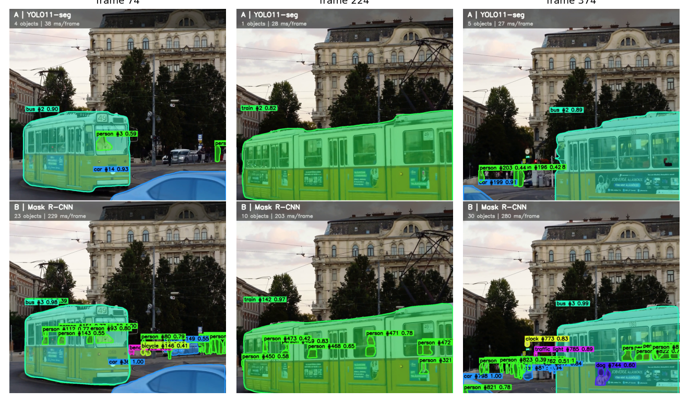

# Video Object Segmentation: YOLO11-seg vs Mask R-CNN (Shorts-style split screen)

Segment every object in a vertical (9:16) video with **two different computer-vision
libraries** and render a **YouTube-Shorts-sized (1080x1920) split-screen comparison**
video — one model on top, the other on the bottom, same footage, same frame.

<p align="center">
  
</p>

[▶ Watch the full comparison video](results/comparison_output.mp4) ·
[▶ Small preview](results/comparison_output_preview.mp4)

## Why this project

This started from Eddie Smolyansky's article
[*The Basics of Video Object Segmentation*](https://medium.com/@eddiesmo/video-object-segmentation-the-basics-758e77321914),
which frames video object segmentation as **pixel-level object tracking** and
introduces the two metrics the field still uses:

- **Region similarity (J)** — IoU between predicted mask and ground truth
- **Contour accuracy (F)** — F-measure over the mask boundary

The article's classic methods (OSVOS, MaskTrack) are **semi-supervised**: they're
given the correct mask for frame 1 and have to track it forward. This repo instead
runs the **unsupervised** setting — each model finds objects on its own, in every
frame, with no hint — using two modern, off-the-shelf libraries, and compares how
they behave on the same clip. See [`docs/METHODOLOGY.md`](docs/METHODOLOGY.md) for
exactly how this maps onto the article's framing, and why the metrics here are
*proxies* for J and F rather than the real thing.

## What it does

```
input video (any size) --> resize/crop to 1080x1920
                              |
              +---------------+---------------+
              |                               |
      Model A: YOLO11-seg              Model B: Mask R-CNN
      (Ultralytics, ByteTrack)         (torchvision, IoU tracker)
              |                               |
        colored masks + IDs             colored masks + IDs
              |                               |
        top half (1080x960)          bottom half (1080x960)
              +---------------+---------------+
                              |
                 stacked 1080x1920 Shorts video
                 + per-frame metrics (CSV/plots)
```

- **Model A — YOLO11-seg** (Ultralytics): single-stage, real-time instance
  segmentation with built-in **ByteTrack** for object IDs.
- **Model B — Mask R-CNN** (torchvision, ResNet-50-FPN-v2): two-stage detector,
  generally slower and often more thorough, paired with a small custom
  IoU-matching tracker (implemented in the notebook, no built-in tracker in
  torchvision).
- Both are trained on **COCO** (80 classes), so the comparison uses the same
  vocabulary.
- Output is piped straight into **ffmpeg** (H.264/yuv420p) — the format YouTube
  and every browser plays natively.

## Results on the sample clip

Full numbers: [`results/metrics_summary.csv`](results/metrics_summary.csv) ·
Charts: [`results/metrics.png`](results/metrics.png)

| Metric | YOLO11-seg (A) | Mask R-CNN (B) |
|---|---:|---:|
| Speed | **30.3 FPS** (33 ms/frame) | 4.1 FPS (242 ms/frame) |
| Avg. objects / frame | 4.0 | **19.6** |
| Distinct tracked IDs (449 frames) | **78** | 993 |
| Temporal stability (IoU of same track, consecutive frames) | **0.88** | 0.71 |
| Mask agreement (A vs B, mean IoU) | 0.51 | 0.51 |

<p align="center"></p>

**Reading these numbers** (input clip: a busy tram/street scene, 2160x3840
source, 30 fps, 449 processed frames — see
[`docs/RESULTS.md`](docs/RESULTS.md) for the full write-up):

- **YOLO11-seg is ~7.3x faster** and its ByteTrack IDs are far more stable —
  78 distinct IDs across the whole clip, close to the true number of people/
  vehicles that ever appear.
- **Mask R-CNN detects roughly 5x more objects per frame** — it picks up small,
  distant, or partially occluded people that YOLO11 misses at this confidence
  threshold. But without a proper tracker its ID count balloons to 993: the
  simple IoU tracker in this repo loses and re-acquires objects constantly in
  a crowd, which also drags its temporal-stability score down.
- **Agreement of ~0.51** says the two models overlap on roughly half their
  mask area on average — expected, since they're finding a different *number*
  of objects to begin with. Frame-by-frame agreement is plotted in
  `results/metrics.png` (bottom-right) and dips further whenever the crowd
  gets denser.
- **Takeaway:** neither number says who is "more correct" — there's no
  ground truth for this clip. Mask R-CNN is the fairer per-frame detector,
  YOLO11-seg + ByteTrack is the fairer *tracker*. See
  [`docs/METHODOLOGY.md`](docs/METHODOLOGY.md#limitations) for why.

## Repo structure

```
.
├── notebook/
│   ├── video_segmentation_split_screen.ipynb   # the Kaggle notebook (run this)
│   └── build_notebook.py                        # generates the .ipynb from source (for diffs/PRs)
├── results/
│   ├── comparison_output.mp4                     # full split-screen output (1080x1920)
│   ├── comparison_output_preview.mp4             # small preview version
│   ├── metrics_summary.csv                       # per-video summary metrics
│   ├── metrics.png                               # summary charts
│   └── contact_sheet.png                         # three sample frames
├── data/
│   └── README.md                                 # how to get/point at input footage (not committed, see below)
├── docs/
│   ├── METHODOLOGY.md                            # how this maps to the article; metric definitions & limits
│   ├── RESULTS.md                                # detailed results write-up
│   └── SETUP.md                                  # step-by-step Kaggle setup
├── requirements.txt
├── LICENSE
└── .gitattributes                                # Git LFS config for video/image assets
```

## Quick start

1. Open `notebook/video_segmentation_split_screen.ipynb` in **Kaggle** (GPU +
   Internet on) — see [`docs/SETUP.md`](docs/SETUP.md) for the full checklist.
2. Point it at your own vertical video (Kaggle Dataset upload) or a free stock
   source (Pexels API key, optional). Config lives in the `CFG` class near the
   top of the notebook.
3. Run all cells. Outputs land in `/kaggle/working/outputs/`.

Running locally instead of Kaggle works too — see
[`requirements.txt`](requirements.txt) and [`docs/SETUP.md`](docs/SETUP.md#running-locally).

## Input footage / licensing

The sample video used for `results/` came from Pexels. Pexels/Pixabay/Mixkit
footage is **free to use but not public domain** — see
[`data/README.md`](data/README.md) for the license note and why the raw input
clip isn't committed to this repo (only the derived comparison video is, which
is this project's own output).

## Extending this

- Add **SAM 2** as a third model/panel — it's the modern, semi-supervised
  successor to the article's OSVOS/MaskTrack, seeded with first-frame boxes.
- Run on **DAVIS 2016/2017** (the dataset from the article) to get *real* J
  and F scores against ground truth, instead of the proxy metrics here.
- Add a "disagreement" panel that highlights only the pixels where A and B
  differ.
- Swap `CFG.LAYOUT`/`CFG.FIT` for a side-by-side layout or letterboxed
  (no-crop) framing.

## Reference

Smolyansky, E. (2017). *The Basics of Video Object Segmentation*.
[medium.com/@eddiesmo](https://medium.com/@eddiesmo/video-object-segmentation-the-basics-758e77321914)

## License

Code in this repo is [MIT-licensed](LICENSE). Model weights (YOLO11, Mask
R-CNN/COCO) and any third-party footage keep their own licenses — see
[`data/README.md`](data/README.md).
