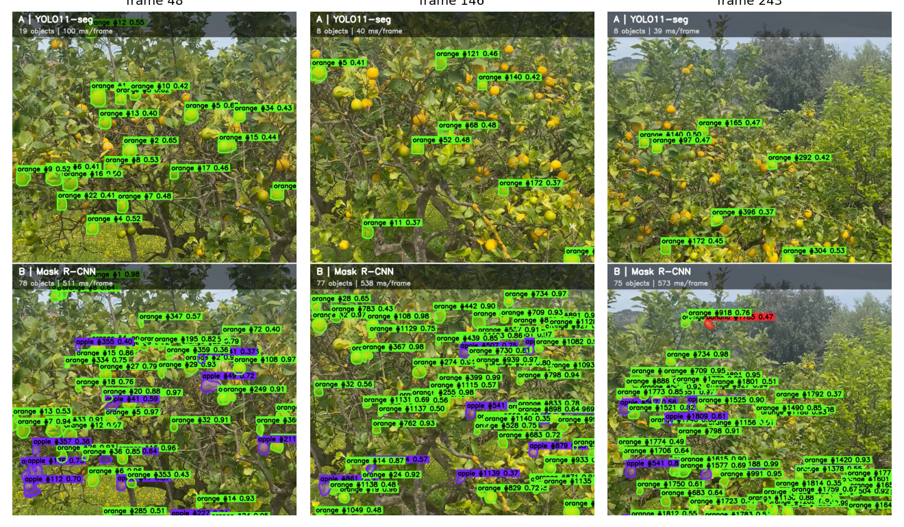
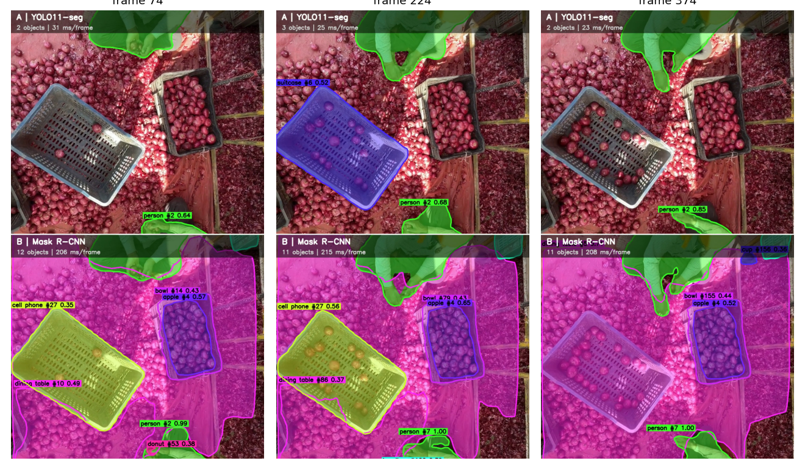
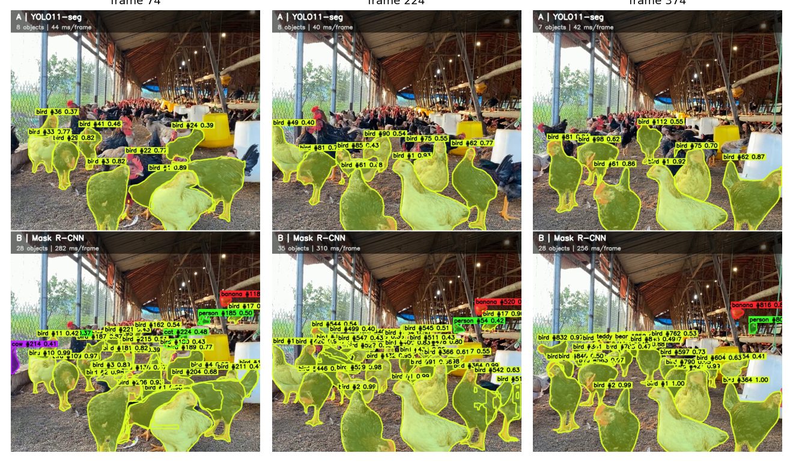
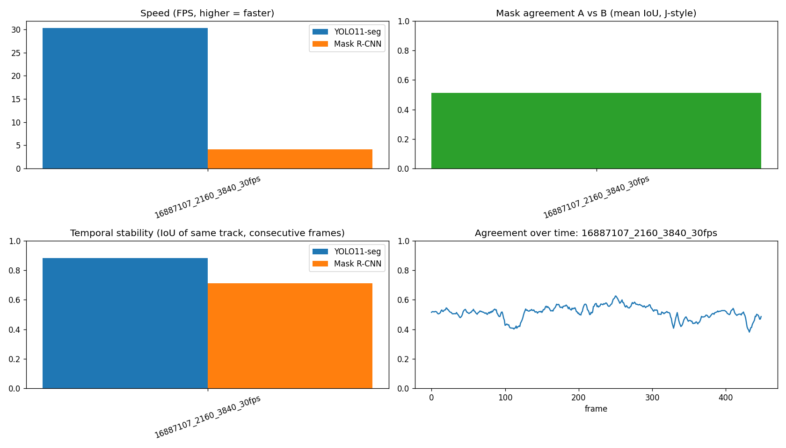
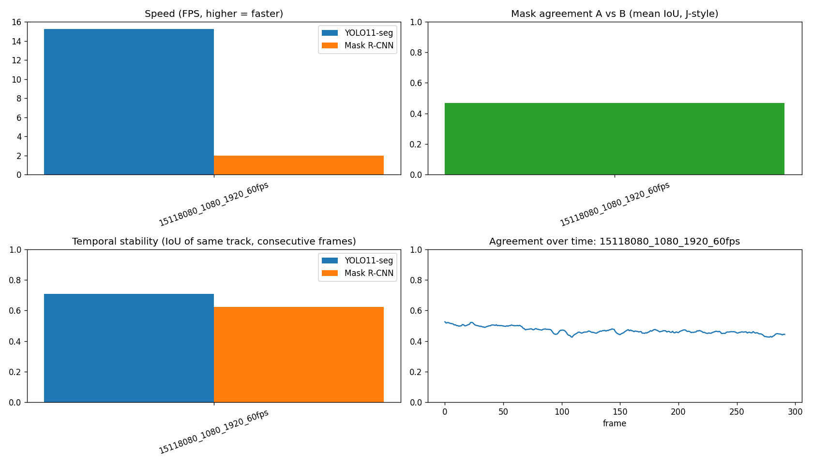
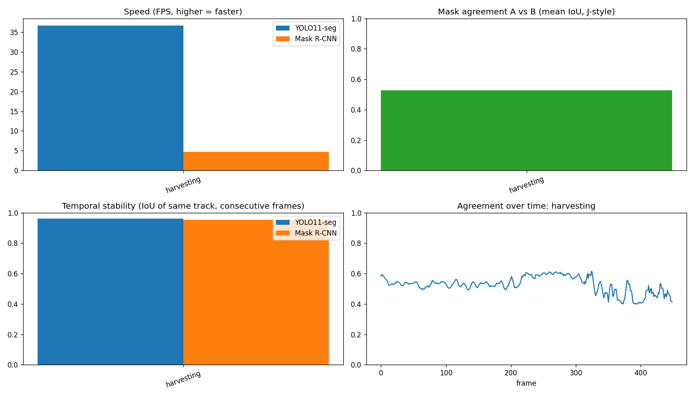
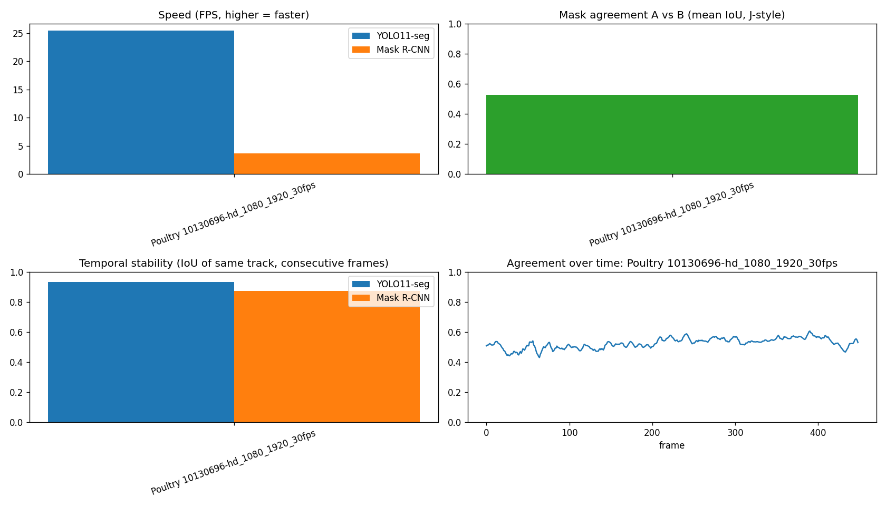

# Video Object Segmentation: YOLO11-seg vs Mask R-CNN (Shorts-style split screen)

Segment every object in a vertical (9:16) video with **two different computer-vision
libraries** and render a **YouTube-Shorts-sized (1080x1920) split-screen comparison**
video — one model on top, the other on the bottom, same footage, same frame.

Four example domains so far, each showing a very different side of the same
two models — see [Results across domains](#results-across-domains) below:

| | Street scene | Citrus orchard | Post-harvest sorting | Poultry farm |
|---|---|---|---|---|
| | [](results/street/comparison_output.mp4) | [](results/citrus/comparison_output.mp4) | [](results/harvesting/comparison_output.mp4) | [](results/poultry/comparison_output.mp4) |
| Video | [▶ full](results/street/comparison_output.mp4) · [▶ preview](results/street/comparison_output_preview.mp4) | [▶ full](results/citrus/comparison_output.mp4) | [▶ full](results/harvesting/comparison_output.mp4) | [▶ full](results/poultry/comparison_output.mp4) |

## Why this project

This started from Eddie Smolyansky's article
[*The Basics of Video Object Segmentation*](https://medium.com/@eddiesmo/video-object-segmentation-the-basics-758e77321914),
which frames video object segmentation as **pixel-level object tracking** and
introduces the two metrics the field still uses:

- **Region similarity (J)** — IoU between predicted mask and ground truth
- **Contour accuracy (F)** — F-measure over the mask boundary

The article's classic methods (OSVOS, MaskTrack) are **semi-supervised**: they're
given the correct mask for frame 1 and have to track it forward. This repo instead
runs the **unsupervised** setting — each model finds objects on its own, in every
frame, with no hint — using two modern, off-the-shelf libraries, and compares how
they behave on the same clip. See [`docs/METHODOLOGY.md`](docs/METHODOLOGY.md) for
exactly how this maps onto the article's framing, and why the metrics here are
*proxies* for J and F rather than the real thing.

## What it does

```
input video (any size) --> resize/crop to 1080x1920
                              |
              +---------------+---------------+
              |                               |
      Model A: YOLO11-seg              Model B: Mask R-CNN
      (Ultralytics, ByteTrack)         (torchvision, IoU tracker)
              |                               |
        colored masks + IDs             colored masks + IDs
              |                               |
        top half (1080x960)          bottom half (1080x960)
              +---------------+---------------+
                              |
                 stacked 1080x1920 Shorts video
                 + per-frame metrics (CSV/plots)
```

- **Model A — YOLO11-seg** (Ultralytics): single-stage, real-time instance
  segmentation with built-in **ByteTrack** for object IDs.
- **Model B — Mask R-CNN** (torchvision, ResNet-50-FPN-v2): two-stage detector,
  generally slower and often more thorough, paired with a small custom
  IoU-matching tracker (implemented in the notebook, no built-in tracker in
  torchvision).
- Both are trained on **COCO** (80 classes), so the comparison uses the same
  vocabulary.
- Output is piped straight into **ffmpeg** (H.264/yuv420p) — the format YouTube
  and every browser plays natively.

## Results across domains

Full numbers: [`results/street/metrics_summary.csv`](results/street/metrics_summary.csv),
[`results/citrus/metrics_summary.csv`](results/citrus/metrics_summary.csv),
[`results/harvesting/metrics_summary.csv`](results/harvesting/metrics_summary.csv),
[`results/poultry/metrics_summary.csv`](results/poultry/metrics_summary.csv)

| Metric | Street — YOLO11 | Street — Mask R-CNN | Citrus — YOLO11 | Citrus — Mask R-CNN | Harvesting — YOLO11 | Harvesting — Mask R-CNN | Poultry — YOLO11 | Poultry — Mask R-CNN |
|---|---:|---:|---:|---:|---:|---:|---:|---:|
| Speed | **30.3 FPS** | 4.1 FPS | **15.3 FPS** | 2.0 FPS | **36.7 FPS** | 4.7 FPS | **25.4 FPS** | 3.7 FPS |
| Avg. objects / frame | 4.0 | **19.6** | 14.2 | **74.6** | 2.5 | **10.8** | 7.0 | **28.1** |
| Distinct tracked IDs | **78** | 993 | **89** | 2,091 | **3** | 195 | **59** | 1,011 |
| Temporal stability | **0.88** | 0.71 | 0.71 | 0.62 | **0.96** | 0.95 | **0.93** | 0.87 |
| A-vs-B agreement | 0.51 | 0.51 | 0.47 | 0.47 | 0.53 | 0.53 | 0.53 | 0.53 |

<p align="center">
  
  
  
  
</p>

**Each domain breaks the two models in a different way.** Mask R-CNN
consistently finds far more objects per frame than YOLO11-seg (5x street,
**5.2x** citrus, **4.4x** harvesting, **4.0x** poultry), always at a large
speed cost (~5-8x slower). But *why* the gap opens, and how dangerous the
extra detections are, differs by scene:

- **Street:** a genuine recall difference — Mask R-CNN catches small/distant
  pedestrians YOLO11 misses at this confidence threshold.
- **Citrus:** recall *and* a species-classification error — some oranges get
  labeled `apple` by both COCO-pretrained models, since neither was trained
  to tell citrus cultivars apart.
- **Harvesting:** a **vocabulary gap**. COCO has no class for onions/crates,
  so YOLO11 mostly declines to label anything (2.5 objects/frame, 0.96
  stability — a more honest failure), while Mask R-CNN hallucinates the
  nearest known class onto the scene (`bowl`, `apple`, `cell phone`,
  `donut`). Its 195 track IDs (vs YOLO11's 3) reflect the tracker following
  a sequence of *wrong* labels, not motion — the camera is static here.
- **Poultry:** COCO *does* have a `bird` class, so both models mostly get
  the base label right — but Mask R-CNN's extra detections (28.1 vs 7.0/
  frame) come partly from **fragmenting a single bird into several
  overlapping masks**, and it still hallucinates unrelated classes
  (`banana`, `cow`, `cat`, `teddy bear`) on individual birds. This is
  arguably the most dangerous variant so far: most of the frame is correct,
  which makes the scattered wrong labels easy to miss compared to
  harvesting's more obviously-wrong output.

See [`docs/RESULTS.md`](docs/RESULTS.md) for the full write-up of all four
runs, and [`docs/METHODOLOGY.md`](docs/METHODOLOGY.md#limitations) for why
none of these numbers say who is "more correct" — there's no ground truth
for any of the clips.

## Repo structure

```
.
├── notebook/
│   ├── video_segmentation_split_screen.ipynb   # the Kaggle notebook (run this)
│   └── build_notebook.py                        # generates the .ipynb from source (for diffs/PRs)
├── results/
│   ├── street/                                   # example 1: busy tram/street scene
│   │   ├── comparison_output.mp4                 # full split-screen output (1080x1920)
│   │   ├── comparison_output_preview.mp4         # small preview version
│   │   ├── metrics_summary.csv                   # per-video summary metrics
│   │   ├── metrics.png                           # summary charts
│   │   └── contact_sheet.png                     # three sample frames
│   ├── citrus/                                    # example 2: citrus orchard (agriculture)
│   │   ├── comparison_output.mp4
│   │   ├── metrics_summary.csv
│   │   ├── metrics.png
│   │   └── contact_sheet.png
│   ├── harvesting/                                # example 3: post-harvest sorting (out-of-vocabulary objects)
│   │   ├── comparison_output.mp4
│   │   ├── metrics_summary.csv
│   │   ├── metrics.png
│   │   └── contact_sheet.png
│   └── poultry/                                   # example 4: poultry farm (in-vocabulary but fragmented/hallucinated)
│       ├── comparison_output.mp4
│       ├── metrics_summary.csv
│       ├── metrics.png
│       └── contact_sheet.png
├── data/
│   └── README.md                                 # how to get/point at input footage (not committed, see below)
├── docs/
│   ├── METHODOLOGY.md                            # how this maps to the article; metric definitions & limits
│   ├── RESULTS.md                                # detailed results write-up
│   └── SETUP.md                                  # step-by-step Kaggle setup
├── requirements.txt
├── LICENSE
└── .gitattributes                                # Git LFS config for video/image assets
```

## Quick start

1. Open `notebook/video_segmentation_split_screen.ipynb` in **Kaggle** (GPU +
   Internet on) — see [`docs/SETUP.md`](docs/SETUP.md) for the full checklist.
2. Point it at your own vertical video (Kaggle Dataset upload) or a free stock
   source (Pexels API key, optional). Config lives in the `CFG` class near the
   top of the notebook.
3. Run all cells. Outputs land in `/kaggle/working/outputs/`.

Running locally instead of Kaggle works too — see
[`requirements.txt`](requirements.txt) and [`docs/SETUP.md`](docs/SETUP.md#running-locally).

## Input footage / licensing

The sample videos used for `results/` (street, citrus, harvesting, poultry) came from Pexels.
Pexels/Pixabay/Mixkit footage is **free to use but not public domain** — see
[`data/README.md`](data/README.md) for the license note and why the raw input
clips aren't committed to this repo (only the derived comparison videos are,
which are this project's own output).

## Extending this

- Add **SAM 2** as a third model/panel — it's the modern, semi-supervised
  successor to the article's OSVOS/MaskTrack, seeded with first-frame boxes.
- Run on **DAVIS 2016/2017** (the dataset from the article) to get *real* J
  and F scores against ground truth, instead of the proxy metrics here.
- Add a "disagreement" panel that highlights only the pixels where A and B
  differ.
- Swap `CFG.LAYOUT`/`CFG.FIT` for a side-by-side layout or letterboxed
  (no-crop) framing.

### Agriculture / precision-farming extensions

The citrus run above shows COCO-pretrained models struggling with small,
clustered, occluded fruit and mixing up species (`orange` vs `apple`). Ways
to push this further, roughly cheapest to most involved:

- **SAHI** (Slicing Aided Hyper Inference) — tiles each frame before running
  either detector, then merges results. The standard fix for small/dense
  objects, no retraining required; a natural "Model C" panel.
- **CitDet** — a purpose-built in-orchard citrus detection dataset; fine-tune
  YOLO on it for a fair citrus baseline instead of relying on COCO's generic
  `orange` class.
- **Roboflow Universe** — search "citrus"/"fruit counting" for community
  fine-tuned YOLOv8/v11 checkpoints that drop straight into this repo's
  `Segmenter` interface.
- **PlantCV** — a full plant-phenotyping toolkit (segmentation + trait
  extraction: fruit size, canopy area, leaf health), useful beyond counting.
- **Other crops to try the same way:** grapes via **WGISD** (Wine Grape
  Instance Segmentation Dataset — clusters, not single fruit), wheat via
  **Global Wheat Head Detection** (dense, tiny, textured heads), or
  strawberries/coffee cherries via Roboflow's ripeness-labeled sets.
- **For bulk/uniform produce (onions, garlic, grain — see the harvesting
  example) instance segmentation may be the wrong tool entirely.** COCO has
  no class for these, so both models here hallucinate a nearest-match label
  instead of counting correctly. Density-map counting approaches (e.g.
  CSRNet, P2PNet-style point counting) that regress a count directly from
  the image, rather than detecting individual instances, are the more
  standard fit for this kind of scene.

## Reference

Smolyansky, E. (2017). *The Basics of Video Object Segmentation*.
[medium.com/@eddiesmo](https://medium.com/@eddiesmo/video-object-segmentation-the-basics-758e77321914)

## License

Code in this repo is [MIT-licensed](LICENSE). Model weights (YOLO11, Mask
R-CNN/COCO) and any third-party footage keep their own licenses — see
[`data/README.md`](data/README.md).
